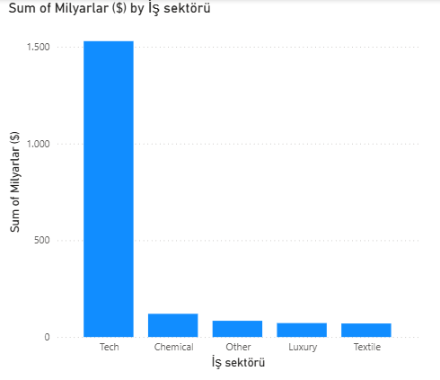

# 💰 Power BI Billionaire Analysis

A data cleaning and visualization project using Power BI, analyzing the world's richest people and their business sectors.

## 📊 Project Overview

This project demonstrates core Power BI skills including data importing, cleaning, transformation, and visualization using two datasets about the world's billionaires.

## 🗂️ Datasets

| File | Description |
|------|-------------|
| `Richest_people.xlsx` | Top 10 billionaires with net worth, age, nationality, and source of wealth (March 2018) |
| `Business_sector.xlsx` | Business sector classification for each company |

## 🛠️ Steps Performed

### 1. Data Import
- Imported `Richest_people.xlsx` into Power BI Desktop

### 2. Data Cleaning (Power Query Editor)
- Renamed columns: `No.` → `Sıra`, `Net worth (USD)(March 2018)[15]` → `Milyarlar ($)`
- Removed `$` sign and `billion` text from the net worth column
- Converted net worth column to **Decimal Number** format

### 3. Data Enrichment
- Created a conditional column **Yaş kategorisi** (Age Category):
  - Age ≥ 80 → `Yaşlı` (Elderly)
  - 50 ≤ Age < 80 → `Orta yas` (Middle-aged)
  - Age < 50 → `Genç` (Young)

### 4. Data Merging
- Imported `Business_sector.xlsx` and cleaned it (promoted headers, removed duplicates)
- Merged the two datasets using `Source(s) of wealth ↔ Companies` columns (Left Outer Join)
- Created a duplicate query renamed **Milyarderler - Sektör** with the expanded `Business sector` column

### 5. Visualization
- Built a **bar chart** showing total billions per business sector
  - X-axis: Business Sector
  - Y-axis: Sum of Milyarlar ($)

## 📈 Key Insights

- The **Tech sector** dominates with the highest total net worth among all sectors
- Followed by **Chemical**, **Other**, **Luxury**, and **Textile**

## 🖼️ Preview

### Bar Chart – Total Net Worth by Business Sector

## 🧰 Tools Used

- Microsoft Power BI Desktop
- Power Query Editor
- Excel (.xlsx)
